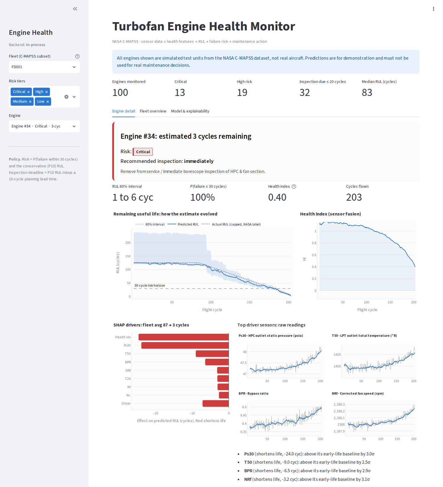

# Turbofan Engine Health Monitor: Predictive Maintenance on NASA C-MAPSS

End-to-end prognostics system that goes past "predict RUL" to an actionable maintenance decision:

```
Sensor data → Health/degradation features → RUL prediction → Failure-risk estimation
            → Maintenance recommendation → Dashboard (Streamlit) + API (FastAPI)
```

> **Engine #34: estimated 3 cycles remaining**
> Risk: **Critical** · Recommended inspection: **immediately**
> Remove from service / immediate borescope inspection of HPC & fan section.



## Results (held-out NASA test sets, last cycle per engine)

| Subset | Conditions / faults | Test RMSE | RMSE over 5 seeds | MAE | NASA score | 80% interval coverage |
|---|---|---|---|---|---|---|
| FD001 | 1 condition, HPC | **13.08** | 13.14 ± 0.15 | 9.43 | 278 | 78% |
| FD002 | 6 conditions, HPC | **12.47** | 12.43 ± 0.10 | 8.65 | 4239 | 81% |
| FD003 | 1 condition, HPC + fan | **13.08** | 13.03 ± 0.16 | 9.23 | 431 | 78% |
| FD004 | 6 conditions, HPC + fan | **14.22** | 14.07 ± 0.15 | 9.91 | 4410 | 82% |

Exact numbers are in `models/metrics.json` and `models/seed_spread.json` (`python -m src.seed_check`).

The high FD002/FD004 NASA scores come from a few healthy engines (true RUL 56 to 86) predicted at 88 to 124.
The exponential PHM08 score punishes these heavily. All of them land in the *Low* tier, whose routine check
within 50 cycles still comes before their actual failure.

**Maintenance-policy checks on the test fleets**

| Subset | True RUL ≤ 15 flagged *Critical* | True RUL ≤ 35 flagged *Critical* or *High* | Inspection due at or after actual failure |
|---|---|---|---|
| FD001 | 10 / 10 | 26 / 26 | 0 / 100 |
| FD002 | 45 / 46 | 66 / 66 | 0 / 259 |
| FD003 | 10 / 10 | 22 / 22 | 0 / 100 |
| FD004 | 34 / 36 | 61 / 61 | 0 / 248 |

The three engines not flagged *Critical* (true RUL 8, 12 and 15) were flagged *High* with an inspection
due in 5 cycles, before their failure.

## How it works

**1. Features (`src/features.py`).** All causal: the feature at cycle t uses only cycles up to t, so the same
code serves training and live, cycle-by-cycle inference (checked by `tests/test_pipeline.py`).
- Operating-regime detection (KMeans on the 3 settings; 6 regimes for FD002/FD004) and per-regime z-scoring
  to remove the flight-condition effect so only degradation remains.
- Automatic removal of non-informative sensors.
- Per sensor: rolling means (5/15/30), rolling std, 20-cycle trend slope, EWMA, drift from early-life baseline
  (115 features for FD001/FD002, 131 for FD003/FD004).
- **Health Index (HI)**: a linear fusion of the normalised sensors (1 = as-new, 0 = failure).

  *Training vs inference.* To fit the HI weights, training engines are labelled "clearly healthy" (first 20%
  of life) and "clearly failed" (last 5%). That labelling needs the eventual failure cycle, which only exists
  for run-to-failure training data. At inference the HI is computed from sensor readings alone; nothing about
  an in-service engine's remaining life is used.

**2. RUL model (`src/train.py`).** LightGBM on a piece-wise linear target (capped at 125 cycles).

**3. Clean out-of-fold errors.** 5-fold GroupKFold by engine. Inside every fold the whole preprocessing chain
(regime clustering, sensor selection, normalisation statistics, HI weights) is refitted on that fold's training
engines only, then applied to the held-out engines. After the folds, the final feature builder and model are
fitted on all training engines. (An earlier version fitted the preprocessing on all engines before splitting.
Fixing that changed OOF RMSE by less than 0.05 cycles, but the fold results are now leak-free by construction.)

**4. Failure risk (`src/risk.py`).** The out-of-fold errors give an empirical error distribution *conditioned
on the predicted RUL* (engines near failure are predicted more precisely). From it: conservative RUL (P10),
80% interval, and **P(failure within 30 cycles)**.

**5. Maintenance policy (`src/config.py`).** A configurable maintenance policy converts probabilistic RUL
estimates into operational risk tiers and inspection windows. The thresholds are design choices, not learned:
C-MAPSS has no maintenance records or costs to learn them from.

| Tier | Rule | Action |
|---|---|---|
| Critical | P10 RUL ≤ 15 | Remove from service / immediate inspection |
| High | P(fail ≤ 30) ≥ 20% or P10 ≤ 35 | Schedule inspection, pre-order spares |
| Medium | P(fail ≤ 30) ≥ 5% or P10 ≤ 60 | Increase monitoring |
| Low | otherwise | Routine check (every 50 cycles) |

Inspection deadline = conservative RUL minus a 10-cycle planning lead time (rounded down to 5).

**6. Explainability.** SHAP (TreeExplainer) values are summed from all features of a sensor back to the
**physical sensor** (e.g. *Ps30: HPC outlet static pressure*, *T50: LPT outlet temperature*), with how many σ
that sensor has drifted from its early-life baseline. Notes for reading them:
- SHAP explains the raw model output; the displayed RUL is that output clipped to 0 to 125 cycles.
- The Health Index is itself a blend of all sensors, so it is shown as its own driver. A sensor's total
  influence is its own bar plus its share of the HI bar.
- Drivers outside the top 8 are combined into "Other", so the bars always add up to the model output.

## Run it

```bash
pip install -r requirements.txt

# run the tests (about 20 s)
python -m pytest -q

# (optional) retrain, about 5 min for all four subsets. The bundled models store only
# numpy arrays and LightGBM's text format, so they load without pyarrow and with any
# pandas / scikit-learn version.
python -m src.train

# API  → http://localhost:8000/docs
uvicorn api.main:app --port 8000

# Dashboard → http://localhost:8501   (on Windows, run .\run_windows.bat from PowerShell to start both)  (uses the API if running, otherwise runs the model in-process)
streamlit run dashboard/app.py
```

Data: the NASA C-MAPSS files are included in `data/` (see `data/README.md` for source and citation), so
the project runs right after cloning. The code looks in `$CMAPSS_DIR`, then `./data`, then the parent folder.

### API endpoints

| Method | Path | Returns |
|---|---|---|
| GET | `/health` | status + available subsets |
| GET | `/policy` | risk horizon, lead time, tier thresholds |
| GET | `/fleet/{subset}?risk=High` | every engine: RUL, interval, P(fail), tier, inspection deadline, action |
| GET | `/fleet/{subset}/summary` | counts by tier, median RUL, inspections due ≤ 20 cycles |
| GET | `/engine/{subset}/{unit}` | full history: RUL trajectory + band, health index, raw sensors |
| GET | `/engine/{subset}/{unit}/explain` | SHAP drivers grouped by physical sensor |
| GET | `/model/{subset}` | test metrics, global importance, predicted-vs-actual |
| POST | `/predict` | score a **new** engine from its raw cycle history |

## Project layout

```
src/config.py     sensor names, regimes, risk policy
src/data.py       loaders + RUL labels
src/features.py   regime normalisation, time-series features, health index
src/risk.py       uncertainty model, risk tiers, maintenance recommendation
src/train.py      training with leak-free OOF errors + evaluation
src/seed_check.py test RMSE spread over random seeds
tests/            pipeline correctness tests
src/service.py    inference, fleet scoring, SHAP (shared by API & dashboard)
api/main.py                FastAPI
dashboard/app.py           Streamlit entry: favicon, page routing, footer
dashboard/monitor.py       main dashboard page
dashboard/legal.py         privacy policy and terms and conditions pages
dashboard/site_config.py   site name, owner, contact, domain, effective date
dashboard/static/          favicon files
models/           trained models + metrics.json
```

Reference: A. Saxena, K. Goebel, D. Simon, N. Eklund, *Damage Propagation Modeling for Aircraft Engine
Run-to-Failure Simulation*, PHM08.

## Launch checklist

Do not make the site public until every item is done.

- [ ] Custom domain connected, served over HTTPS, and `SITE_URL` set in `dashboard/site_config.py`
- [x] Favicon (`dashboard/static/favicon.png`)
- [x] No "made with" badges: Streamlit's Deploy button and developer menu are hidden (`toolbarMode = "viewer"`).
      If you host on Streamlit Community Cloud, its "Hosted with Streamlit" badge cannot be removed, so use
      Render, Railway, Fly.io or a VPS instead.
- [x] Privacy policy page (`/privacy`)
- [x] Terms and conditions page (`/terms`)
- [ ] Owner name, contact link and effective date in `dashboard/site_config.py` reviewed
- [ ] Legal pages read through by you (they describe what this code does; update them if you add analytics, sign-in or forms)
